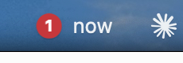

# Subway Menu Bar

A tiny macOS menu bar app for the NYC subway. Pick the lines you care about,
and it shows the next trains at the nearest station to you, right in the menu
bar, with proper MTA bullets. Click it to see where each train is headed.



- **Lives in the menu bar.** No Dock icon, no window. Just a row of bullets with minutes.
- **Location-aware.** Uses your Mac's location to find the nearest station for
  each line you follow. Falls back to a manual location you can type in.
- **Shows direction and destination.** The dropdown lists northbound and
  southbound trains with their terminal ("→ Coney Island-Stillwell Av").
- **Real MTA data, no API key.** Reads the MTA's public GTFS-Realtime feeds
  directly. Colors and station names come from the MTA's own GTFS files.
- **No dependencies.** Pure Swift + AppKit. Builds with the Xcode Command Line
  Tools alone; no Xcode project, no package downloads.

## Requirements

- macOS 13 Ventura or later (Apple silicon or Intel)
- Xcode Command Line Tools (`xcode-select --install`), Swift 5.9+

## Quick start

```bash
git clone https://github.com/Sagar-CK/subway-menubar.git
cd subway-menubar
./scripts/run.sh
```

The first launch asks for location access. Allow it, and within a few seconds
the subway icon turns into live arrivals for the nearest station.

`scripts/run.sh` compiles with Swift Package Manager, wraps the binary in
`build/SubwayMenuBar.app`, and opens it. To keep it around, drag
`build/SubwayMenuBar.app` into `/Applications`.

## Using it

**Menu bar.** Each entry is `bullet + minutes` for the soonest train on that
line at its nearest station, sorted by time. Up to four lines are shown.
`now` means the train is due within the minute.

**Dropdown.** Click the item to see, for each station:

```
Times Sq-42 St  ·  0.2 mi
  NORTHBOUND
    N   4 min  →  Astoria-Ditmars Blvd
    Q   9 min  →  96 St
  SOUTHBOUND
    N   2 min  →  Coney Island-Stillwell Av
```

"Northbound" and "Southbound" follow the MTA's railroad direction convention:
north is generally uptown / The Bronx / Queens, south is downtown / Brooklyn.
The destination tells you which branch the train takes.

**Lines submenu.** Check the lines you want to follow. The app then shows, for
each checked line, the closest station that line is currently serving (judged
from live data, so it adapts to weekend service changes). With *All Lines*
selected it simply shows the single nearest station.

**Nearby Radius submenu.** This is what makes a commute set work. Follow
`1`, `R`, and `W`, and the app shows only the followed lines that have a
station within the radius (default ½ mile). At home you see just the 1; at
work just the R and W; at Times Square all three. The single closest station
is always shown so the menu bar is never empty. Pick *No limit* to always show
every followed line.

**Location submenu.** *Use Mac Location* (default) or *Set Location Manually…*
and type `latitude, longitude`, e.g. `40.7580, -73.9855` for Times Square.
Handy when you're not in New York or your Mac has no Wi-Fi positioning.

**Refresh.** Feeds are polled every 30 seconds. ⌘R in the menu forces a refresh.

## Configuration

Everything is stored in `UserDefaults` under `com.sagarck.SubwayMenuBar`, so
you can also set it from a shell:

| Key | Type | Meaning | Default |
| --- | --- | --- | --- |
| `selectedRoutes` | array of strings | Lines to follow, e.g. `N A`. Empty = all lines. | empty |
| `manualLatitude` / `manualLongitude` | float | Overrides the Mac's location when both are set. | unset |
| `refreshInterval` | int (seconds, ≥10) | Feed polling interval. | 30 |
| `nearbyRadiusMeters` | int (meters) | Hide followed lines with no station this close. `0` = no limit. | 800 |

```bash
defaults write com.sagarck.SubwayMenuBar selectedRoutes -array N A
defaults write com.sagarck.SubwayMenuBar refreshInterval -int 20
defaults delete com.sagarck.SubwayMenuBar manualLatitude   # back to Mac location
```

Restart the app after changing values from the shell.

## Headless mode (debugging)

You can run the whole pipeline without the GUI, which is useful for checking
feed parsing or trying a location:

```bash
swift run SubwayMenuBar --print --at 40.7580,-73.9855 --lines N,A
```

This fetches the feeds once, prints the menu bar entries and the full board for
that spot, and exits. Omit `--at` / `--lines` to use your saved preferences.

## How it works

1. **Static data.** `stops.txt` and `routes.txt` from the MTA's GTFS bundle are
   shipped inside the app. They give station names, coordinates, and the
   official line colors.
2. **Live data.** Every 30 s the app downloads the GTFS-Realtime feeds for the
   lines you follow (eight feeds cover the whole system) and decodes the
   protobuf with a small built-in reader.
3. **Board building.** Each trip's upcoming stops become "arrivals" at a
   station in a direction. For each followed line, the nearest station with an
   upcoming train is chosen, then stations beyond the nearby radius are
   dropped (except the closest). Trains that terminate there are dropped too.
4. **Rendering.** Bullets are drawn as circles with the line letter, composed
   into the status item title and menu rows as attributed strings.

See [docs/ARCHITECTURE.md](docs/ARCHITECTURE.md) for the code layout and
[docs/MTA-DATA.md](docs/MTA-DATA.md) for the data feeds and their quirks.

## Development

```bash
swift build                 # debug build
swift run SubwayMenuBar --print   # headless check against live feeds
swift test                  # unit tests (needs full Xcode for XCTest)
./scripts/build-app.sh      # assemble build/SubwayMenuBar.app
```

The unit tests use XCTest, which ships with Xcode but not with the standalone
Command Line Tools. CI runs them on every push via GitHub Actions
(`.github/workflows/ci.yml`).

To refresh the bundled station list after an MTA service change, download the
current GTFS bundle and replace the two files:

```bash
curl -L -o /tmp/gtfs_subway.zip https://rrgtfsfeeds.s3.amazonaws.com/gtfs_subway.zip
unzip -o -j /tmp/gtfs_subway.zip stops.txt routes.txt -d Sources/SubwayMenuBar/Resources/
```

## Troubleshooting

| Symptom | What to do |
| --- | --- |
| Only a tram icon, dropdown says "Requesting location access…" | Approve the prompt, or go to System Settings › Privacy & Security › Location Services and enable Subway Menu Bar. Or set a manual location. |
| Nearest station is hundreds of miles away | You're outside NYC. Use *Set Location Manually…*. |
| "Couldn't reach the MTA feeds." | The MTA endpoint is down or you're offline. The app keeps retrying every refresh. |
| `swift test` fails with "no such module 'XCTest'" | Install Xcode, or rely on CI. `swift build` and `swift run` work without it. |
| Location permission keeps re-prompting | `scripts/build-app.sh` ad-hoc signs the app so macOS remembers the choice. If you copied the binary elsewhere, rebuild with the script. |

## Contributing

Issues and pull requests are welcome. See [CONTRIBUTING.md](CONTRIBUTING.md).

## License and data

Code is released under the [MIT License](LICENSE).

Subway data comes from the Metropolitan Transportation Authority's open data
feeds under the [MTA developer data terms](https://www.mta.info/developers).
This project is not affiliated with or endorsed by the MTA. Line colors and
names are used to match official signage so riders can read them at a glance.
